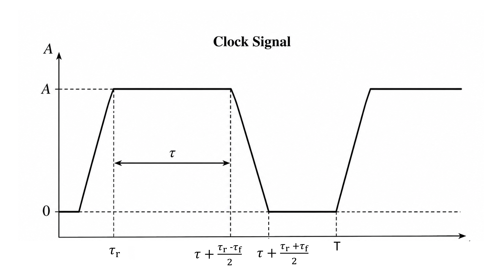
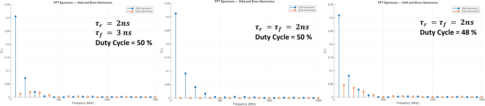
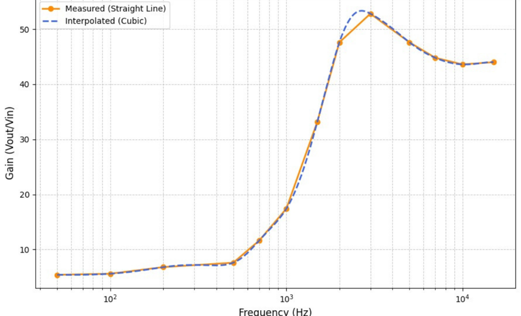

# Portable EMI/EMC Meter

A portable, low-cost EMI/EMC measurement system for sensing and characterizing high-frequency electr   omagnetic emissions from electronic and digital switching systems.Modern digital and power-electronic systems rely on increasingly fast switching signals. Although a digital clock is typically specified by its fundamental frequency, its finite rise and fall times introduce a broad spectrum of higher-order harmonics.

## Spectral Analysis of a Practical Digital Clock

Practical digital clock signals have finite rise and fall times. These non-ideal transitions generate higher-order harmonics that can extend far beyond the fundamental clock frequency.

For a periodic waveform with period \(T\),

$$
f_n = n f_0 = \frac{n}{T}
$$

where \(f_0\) is the fundamental frequency and \(n\) is the harmonic order.

A trapezoidal clock can be characterized by amplitude \(A\), period \(T\), rise time \(T_r\), fall time \(T_f\), and high-state duration \(\tau\). For a symmetric waveform, \(T_r=T_f\), the harmonic amplitudes can be approximated by

$$

|C_n|=
\frac{2A\tau}{T}
\left|
\frac{\sin(n\pi T_r/T)}
{n\pi T_r/T}
\right|
\left|
\frac{\sin(n\pi\tau/T)}
{n\pi\tau/T}
\right|
$$

For the simulations, a \(50~\mathrm{MHz}\) clock was considered:

$$
f_0=50~\mathrm{MHz},
\qquad
T=20~\mathrm{ns}
$$

  

### Effect of Rise/Fall Time and Duty Cycle

In many practical digital-clock applications, the duty cycle is designed to be close to \(50\%\). This condition is particularly interesting from an EMI/EMC perspective because, for the symmetric case \(T_r=T_f\), the Fourier-series coefficient can be written as

$$
|C_n|=
\frac{2A\tau}{T}
\left|
\frac{\sin(n\pi T_r/T)}
{n\pi T_r/T}
\right|
\left|
\frac{\sin(n\pi\tau/T)}
{n\pi\tau/T}
\right|.
$$

For a \(50\%\) duty cycle,

$$
\tau=\frac{T}{2},
$$

and therefore the second term becomes

$$
\left|
\frac{\sin(n\pi/2)}
{n\pi/2}
\right|.
$$

For even harmonics, \(n=2k\),

$$
\sin\left(\frac{2k\pi}{2}\right)
=
\sin(k\pi)
=
0,
$$

giving

$$
\boxed{C_{2k}=0}.
$$

Thus, an ideal symmetric \(50\%\)-duty-cycle clock suppresses all even-order harmonics. This property is particularly useful for **EMI/EMC characterization of high-speed digital clocks**, since it provides a clear spectral signature of waveform symmetry. In practical systems, deviations from \(50\%\) duty cycle or asymmetry between the rise and fall times cause the suppressed even harmonics to reappear. These even-order components can therefore provide a useful indication of non-ideal switching behavior and waveform asymmetry.

  

**Figure:** FFT spectra of the \(50~\mathrm{MHz}\) trapezoidal clock for different rise/fall times and duty cycles.

As shown in the figure above, this characteristic is clearly visible in the simulated spectra. For the symmetric case with \(T_r=T_f=2~\mathrm{ns}\) and a \(50\%\) duty cycle, the even-order harmonics are suppressed, while the odd-order harmonics remain prominent. For the other two cases, either the rise and fall times are asymmetric or the duty cycle deviates from \(50\%\), resulting in the reappearance of the even-order harmonics. This demonstrates that both the duty cycle and the symmetry of the transition times play an important role in determining the harmonic content of a practical digital clock.
### Spectral Envelope

Taking the logarithm of the analytical expression above and using

$$
f=\frac{n}{T},
$$

the frequency-dependent terms can be written as

$$
\frac{\sin(n\pi T_r/T)}{n\pi T_r/T}
=
\frac{\sin(\pi fT_r)}{\pi fT_r}
$$

and

$$
\frac{\sin(n\pi\tau/T)}{n\pi\tau/T}
=
\frac{\sin(\pi f\tau)}{\pi f\tau}.
$$

For the asymptotic regions, this gives

$$
|C_n|\propto
\begin{cases}
f^0, & f\ll 1/\tau,\\[4pt]
f^{-1}, & 1/\tau\ll f\ll 1/T_r,\\[4pt]
f^{-2}, & f\gg 1/T_r.
\end{cases}
$$

Hence, in decibels,

$$
\boxed{
|C_n|_{\mathrm{dB}}\propto
\begin{cases}
0~\mathrm{dB/decade}, & f<1/\tau,\\[4pt]
-20~\mathrm{dB/decade}, & 1/\tau<f<1/T_r,\\[4pt]
-40~\mathrm{dB/decade}, & f>1/T_r.
\end{cases}}
$$

For \(\tau=10~\mathrm{ns}\) and \(T_r=T_f=2~\mathrm{ns}\),

$$
\frac{1}{\tau}=100~\mathrm{MHz},
\qquad
\frac{1}{T_r}=500~\mathrm{MHz}.
$$

The analytical spectrum together with the FFT harmonics and these asymptotic
regions is shown below.

  

**Figure:** Analytical and FFT spectrum of the 50 MHz trapezoidal clock,
showing the \(1/\tau\) and \(1/T_r\) break frequencies and the corresponding
spectral roll-off.

This plot is important for EMI/EMC analysis because it shows that the
high-frequency content of a digital clock is determined strongly by its pulse
width and rise/fall time. Thus, even a clock with a relatively low fundamental
frequency can produce significant spectral components at much higher
frequencies.

## V1 — Initial Portable EMI/EMC Sensor

The first prototype (V1) was developed as a compact, low-cost EMI/EMC sensing
platform based on a coil-type sensing element and an analog front-end (AFE).
The PCB was designed and fabricated as a compact board, with the sensing and
signal-conditioning circuitry integrated into a portable form factor.

<!-- V1 PCB layout -->

  

The assembled V1 prototype was experimentally tested using external test
equipment to characterize its response to electrical excitation.

<!-- V1 experimental setup -->

  

The frequency response was characterized by sweeping the excitation frequency
of a radiating coil at an approximately 5 cm coil-to-sensor distance. The gain-bandwidth product of the whole system from coil to AFE output was claculated to be : 

$$
\mathrm{GBW}_{\mathrm{exp}}\approx 50\times3~\mathrm{kHz}
\approx150~\mathrm{kHz}.
$$

This measurement establishes the baseline frequency response and bandwidth
limitation of the V1 sensing system.

<!-- V1 frequency response -->

  

The V1 implementation establishes the basic sensing concept and provides the
experimental foundation for the higher-bandwidth versions of the system.

## V2 — Higher-Bandwidth Sensing and Embedded FFT

The second version (V2) focuses on overcoming the bandwidth and processing
limitations identified in V1. The analog front-end was redesigned using a
higher-gain-bandwidth operational amplifier to extend the usable frequency
range of the sensing chain.

In addition to the improved analog front-end, preliminary embedded
frequency-domain processing was implemented using an ESP32. This enables the
captured signal to be transformed into the frequency domain and provides a
path toward real-time spectral monitoring of digital and switching systems.

The V2 development demonstrates the transition from a basic sensing prototype
toward an integrated EMI/EMC measurement platform. The work has been presented
at Inventive and has been accepted at IEEE PEDES 2026. A related patent has also
been published and is currently pending grant with apllication ID 202631013071.

## V3 — Future Development

The final objective of the project is to develop a ready-to-use portable
EMI/EMC measurement instrument. The planned V3 architecture will extend the
current system through:

- Multiple interchangeable EMI/EMC probes for different measurement
  configurations.
- A higher-frequency and higher-bandwidth analog front-end.
- FPGA-based real-time DSP and FFT processing.
- Integrated spectrum monitoring and display.
- A compact, standalone and portable enclosure.
- Improved measurement flexibility for digital, power-electronic and
  switching systems.

The development of the FPGA-based DSP and monitoring/display subsystem has
already been initiated. The long-term objective is to combine the sensing,
analog conditioning, high-speed acquisition, digital signal processing and
display into a single portable instrument.

## Repository and Data Availability

The repository will be progressively updated as the project develops.
Simulation files, PCB design files, firmware, MATLAB analysis scripts and
experimental results will be added where appropriate.

Detailed LTspice simulations, complete circuit parameters, measurement data
and additional experimental results will be released progressively once the
corresponding research work and publications are finalized. This approach is
intended to ensure that the repository remains consistent with the published
work and associated intellectual-property considerations.

Additional hardware documentation, datasets and analysis files will be made
available in future releases as the project progresses toward the final V3
portable implementation.
